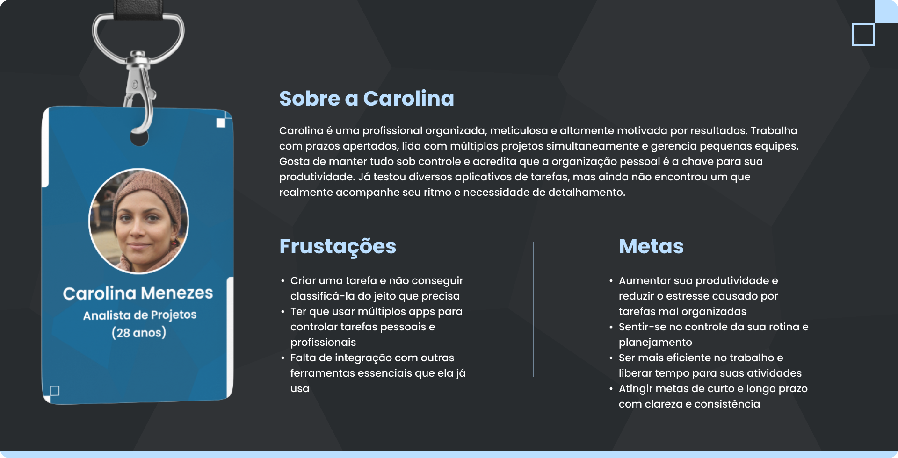

# Web Application Document - Projeto Individual - Módulo 2 - Inteli

## TaskFlow: Sistema Inteligente de Gerenciamento de Tarefas

#### Autor do projeto: José Antônio Ferreira de Lima

## Sumário

1. [Introdução](#c1)  
2. [Visão Geral da Aplicação Web](#c2)  
3. [Projeto Técnico da Aplicação Web](#c3)  
4. [Desenvolvimento da Aplicação Web](#c4)  
5. [Referências](#c5)  

 

## 1. Introdução

O TaskFlow é um sistema web de gerenciamento de tarefas projetado para profissionais que lidam com múltiplos projetos simultaneamente e precisam de uma ferramenta abrangente para organizar seu fluxo de trabalho. Diferentemente de outras soluções disponíveis no mercado, o TaskFlow oferece uma abordagem integrada que combina gerenciamento de tarefas com análise de produtividade e planejamento estratégico.

O sistema permite aos usuários criar, classificar e priorizar tarefas usando um sistema intuitivo de categorização. Os usuários podem dividir projetos complexos em subtarefas gerenciáveis, definir prazos realistas e monitorar o progresso através de painéis visuais personalizáveis. Uma funcionalidade diferencial do TaskFlow é a capacidade de integração com outras ferramentas essenciais de trabalho, como calendários, e-mails e plataformas de comunicação, eliminando a necessidade de alternar entre múltiplos aplicativos.

Além disso, o sistema oferece análises detalhadas de produtividade, identificando padrões de trabalho e sugerindo otimizações para aumentar a eficiência. O TaskFlow foi concebido para ser altamente personalizável, permitindo que cada usuário adapte a interface e funcionalidades às suas necessidades específicas de organização e detalhamento.

---

## 2. Visão Geral da Aplicação Web

### 2.1. Personas

**Carolina Menezes**
* **Idade:** 28 anos
* **Ocupação:** Analista de Projetos
* **Sobre:** Carolina é uma profissional organizada, meticulosa e altamente motivada por resultados. Trabalha com prazos apertados, lida com múltiplos projetos simultaneamente e gerencia pequenas equipes. Gosta de manter tudo sob controle e acredita que a organização pessoal é a chave para sua produtividade. Já testou diversos aplicativos de tarefas, mas ainda não encontrou um que realmente acompanhe seu ritmo e necessidade de detalhamento.

**Frustrações:**
* Criar uma tarefa e não conseguir classificá-la do jeito que precisa
* Ter que usar múltiplos apps para controlar tarefas pessoais e profissionais
* Falta de integração com outras ferramentas essenciais que ela já usa

**Metas:**
* Aumentar sua produtividade e reduzir o estresse causado por tarefas mal organizadas
* Sentir-se no controle da sua rotina e planejamento
* Ser mais eficiente no trabalho e liberar tempo para suas atividades
* Atingir metas de curto e longo prazo com clareza e consistência

**Como o TaskFlow ajuda Carolina:**
O TaskFlow oferece a Carolina um sistema centralizado onde ela pode gerenciar todos os seus projetos e tarefas com o nível de detalhamento que ela necessita. A plataforma permite categorização avançada, integração com outras ferramentas que ela já utiliza e oferece relatórios de produtividade que ajudam Carolina a otimizar seu tempo e esforço. Com o TaskFlow, ela pode manter o controle completo sobre sua agenda profissional e pessoal sem precisar alternar entre diferentes aplicativos.

### 2.2. User Stories

**US01 | Como analista de projetos, quero poder categorizar minhas tarefas em múltiplos níveis e dimensões (projeto, prazo, prioridade, área da vida), para que eu possa organizar meu trabalho de acordo com minha metodologia pessoal de produtividade.**

**US02 | Como profissional que gerencia múltiplos projetos, quero visualizar minhas tarefas em diferentes formatos (lista, quadro Kanban, calendário, timeline), para que eu possa adaptar a visualização conforme minha necessidade do momento.**

**US03 | Como usuária de múltiplas ferramentas digitais, quero integrar o sistema de tarefas com minhas outras plataformas de trabalho (email, calendário, Slack), para que eu possa centralizar informações sem perder atualizações importantes.**

**Análise INVEST da US01:**

* **Independente:** Esta User Story pode ser implementada sem depender diretamente de outras funcionalidades. O sistema de categorização pode funcionar de forma autônoma, mesmo que outras features (como visualizações ou integrações) ainda não estejam implementadas.

* **Negociável:** A implementação pode ser ajustada em termos de quais níveis de categorização serão incluídos inicialmente. Podemos começar com categorização por projeto e prioridade, e adicionar dimensões adicionais em iterações futuras.

* **Valiosa:** Essa funcionalidade representa um diferencial claro para o usuário, pois atende diretamente à frustração da Carolina de "não conseguir classificar tarefas do jeito que precisa". É um valor tangível que aumenta significativamente a utilidade do sistema.

* **Estimável:** A equipe de desenvolvimento pode facilmente estimar o esforço necessário para criar diferentes níveis de categorização, pois envolve principalmente estruturas de dados e interfaces de usuário para seleção e filtragem - componentes com complexidade conhecida.

* **Small (Pequena):** A funcionalidade é suficientemente delimitada para ser implementada em um único sprint. Pode ser dividida em sub-itens ainda menores se necessário (ex: primeiro implementar categorização por projeto, depois por prioridade, etc).

* **Testável:** É possível verificar objetivamente se a funcionalidade atende aos requisitos através de testes como: "O usuário consegue criar uma nova categoria?", "As tarefas podem ser filtradas por múltiplas categorias simultaneamente?", "As categorias são persistidas corretamente no banco de dados?".

---

## 3. Projeto da Aplicação Web

### 3.1. Modelagem do banco de dados  (Semana 3)

*Conteúdo a ser preenchido na Semana 3*

### 3.1.1 BD e Models (Semana 5)

*Conteúdo a ser preenchido na Semana 5*

### 3.2. Arquitetura (Semana 5)

*Conteúdo a ser preenchido na Semana 5*

### 3.3. Wireframes (Semana 03)

*Conteúdo a ser preenchido na Semana 3*

### 3.4. Guia de estilos (Semana 05)

*Conteúdo a ser preenchido na Semana 5*

### 3.5. Protótipo de alta fidelidade (Semana 05)

*Conteúdo a ser preenchido na Semana 5*

### 3.6. WebAPI e endpoints (Semana 05)

*Conteúdo a ser preenchido na Semana 5*

### 3.7 Interface e Navegação (Semana 07)

*Conteúdo a ser preenchido na Semana 7*

---

## 4. Desenvolvimento da Aplicação Web (Semana 8)

### 4.1 Demonstração do Sistema Web (Semana 8)

*Conteúdo a ser preenchido na Semana 8*

### 4.2 Conclusões e Trabalhos Futuros (Semana 8)

*Conteúdo a ser preenchido na Semana 8*

## 5. Referências

*Referências a serem adicionadas conforme o desenvolvimento do projeto*